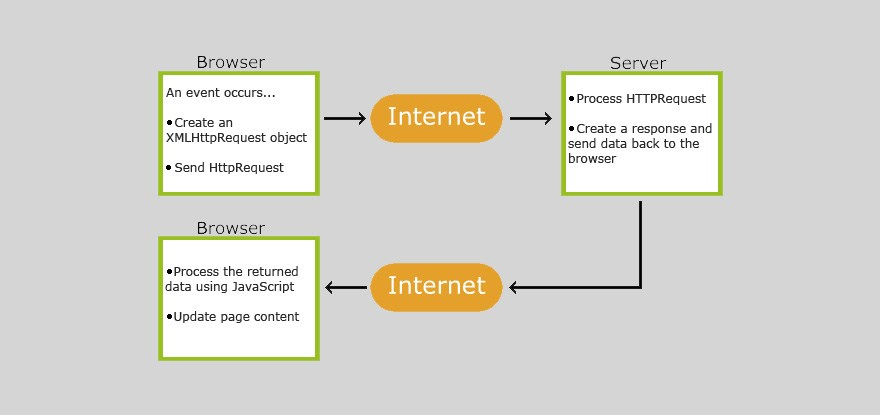

# AJAX Tutorial
This tutorial will introduce you to the basics of AJAX (Asynchronous JavaScript And XML) by building a basic web page that asks the user to input a number.  When the user clicks a button, AJAX will asynchronously request a pokemon that corresponds with that number by exposing the [pokeAPI](https://pokeapi.co/).

> This is an example of exposing a REST API.

AJAX stands for **A**synchronous **J**avaScript **A** nd **X**ML. AJAX allows web pages to be updated asynchronously by exchanging data with a web server behind the scenes. This means that it is possible to update parts of a web page, without reloading the whole page. This tutorial will show you how to create a webpage that does the following:

## How to Use This Demo
*Before attempting to code out this example yourself, scroll down and check out the fundamentals of AJAX.

1. Check out the `html` document [here](./ajax.html).
2. Create a new `.html` file in VSCode and type out the html you see in the example.
3. Create a new `.js` file in VSCode and link it to your html file.\
    > Remember, always put your `<script>` tag in the bottom of the `<body>` of your `.html` file.
4. Follow the steps in the JavaScript file - the notes are there to explain what's going on and how AJAX works behind the scenes.
5. Get creative! Add some styling to your page, link to the Bootstrap4 CDN, or maybe swap out the Poke API for the StarWars API. :slightly_smiling_face:	

## How AJAX Works

1. An event occurs in a web page (the page is loaded, a button is clicked)
2. An XMLHttpRequest object is created by JavaScript
3. The XMLHttpRequest object sends a request to a web server
4. The server processes the request
5. The server sends a response back to the web page
6. The response is read by JavaScript
7. Proper action (like page update) is performed by JavaScript
